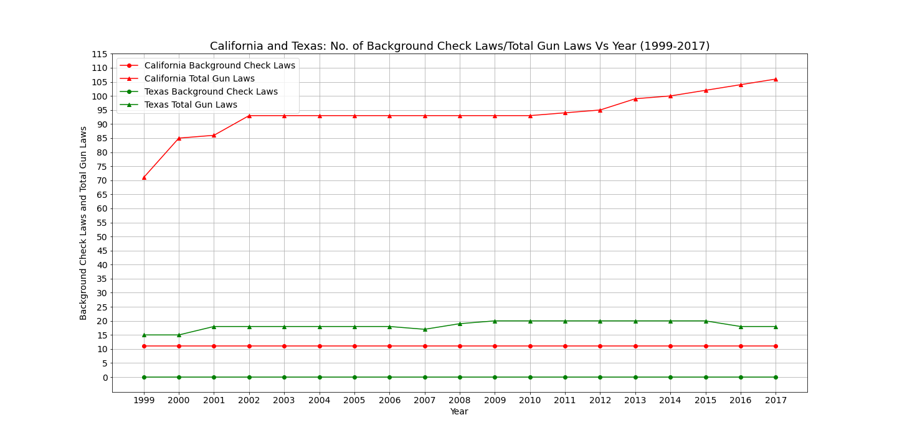
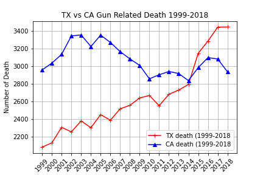
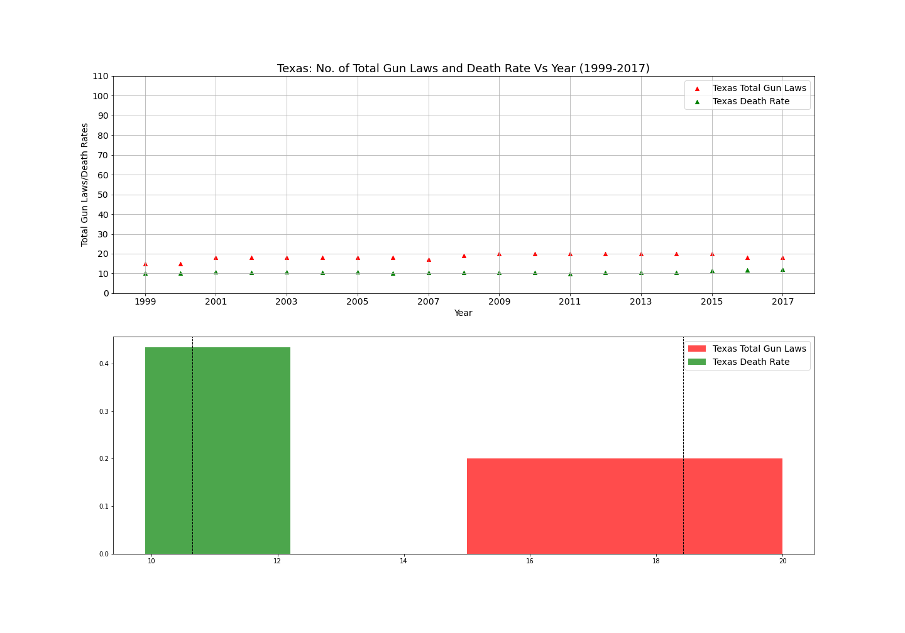
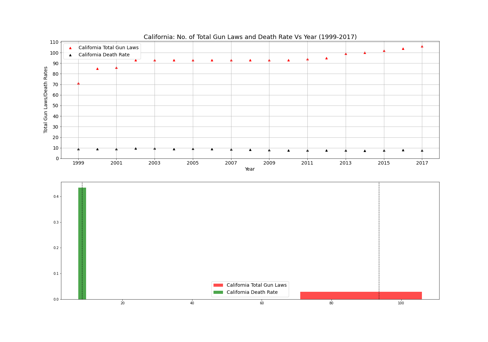
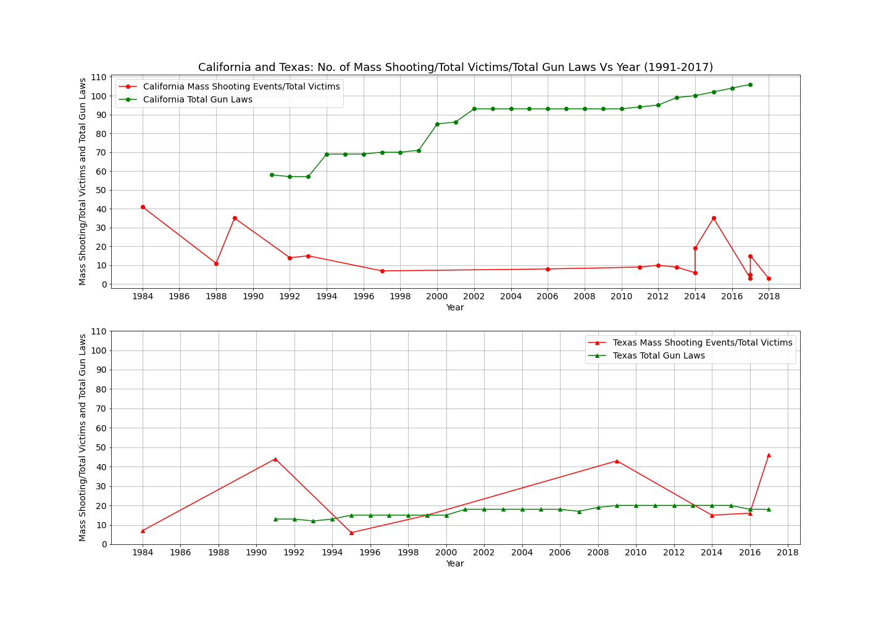
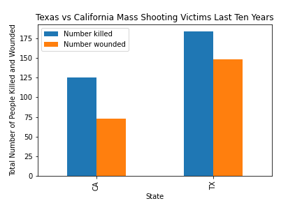

# Gun Laws Analysis  

Team Members: Rene Martinez, Eltahir Gotar, and Aaron Snytka.

 **GUN AND BACKGROUND CHECK**

## Background:

Gun control is a very sensitive issue in America and has been throughout our history. The debate about changing the Second Amendment and 

introducing more strict gun laws has been going on for years. In this project we looked at gun laws at state level and analyzed their 

effectiveness in lowering gun's related deaths. We also evaluated the idea that stricter gun laws reduces gun's related deaths.

Time period for this analysis is from 1999-2018.
We used the states of Texas and California as a case study for two reasons:

 1- They are the most populous states in America.
 
 2- California is an obliged (applicants will be granted license as long as they meet extensive requirements). While Texas is a non obliged state 
(applicants will be granted license as long as they meet basic requirements) [Learn More](https://giffords.org/lawcenter/gun-laws/policy-areas/background-checks/universal-background-checks/).

#### TX & CA Background Check and Total Gun Laws

Description/Outline: THE EFFECTIVENESS OF BACKGROUND CHECKS ACROSS STATES WITH OBLIGED AND NON OBLIGED BACKGROUND REQUIREMENT IN RELATION TO CRIME RATES DUE TO GUN DEATHS

**Data sources:**
* Mass shooting data downloaded from Everytown for Gun safety Support Fund [everytownresearch](https://www.everytownresearch.org/mass-shooting-in-america-2009-2019).
* Gun laws data downloaded from opendatasoft website [Opendatasoft](https://public.opendatasoft.com/explore/?sort=modified).
* Populations data from Census bureau [Census](https://www.census.gov/data/tables/time-series/demo/popest/2010s-state-total.html).
* Gun related death data from [CDC](http://wonder.cdc.gov/wonder/help/mcd.html#2014-Revision).
* Firearm mortality data from [CDC](https://www.cdc.gov/nchs/pressroom/sosmap/firearm_mortality/firearm.htm).
* Firearm data from gunpolicy website [gunpolicy](https://www.gunpolicy.org/api).
* The National Crime Victimization Survey (NCVS) data from the bureau of justice [bjs](https://www.bjs.gov/developer/ncvs/index.cfm).
* Firearm background checks data from [BuzzFeedNews](https://github.com/BuzzFeedNews/nics-firearm-background-checks/tree/master/data).

### Research Questions:

We tried to answer three questions in this analysis. from 1999-2018:
   
   * What are the firearm's related death rates in Texas and California?
   
   * How do the background checks and other gun laws effect firearm's related death rates?
   
   * How many mass shooting incidents happens in both states?
   
### Tasks Breakdown:
   
   * Parse background check data for Texas and California from 1999-2018, store in a table, and plot a line graph for each state showing the time frame.
   
   * Parse firearm related crime rates in Texas and California from 1999-2018, store in a table, and plot each state’s result in a line graph.
   
   * Determine if there is a correlation between background checks and firearm related crimes by creating a scatter plots of Texas and California showing background    checks and firearm related crime rates.
   
   * Draw a map of mass shooting in both states for the timeframe of the analysis.
      
   * Make graphs for each task.

## Analysis:

**First:**

We looked at gun related deaths for each state. 

#### CA vs TX Guns Related Deaths

As you can see from the above chart: 

General trend is that Texas gun related deaths is going up while California is going down, however, through out the course of this analysis time 

from 1999-2018, California numbers are very much the same in 1999 and 2018. Indeed, Texas have more gun related deaths in 2018 than 

California, but over all, California numbers did not improve much. this become more obvious with next analogy.

**Second:**

We looked at state total number of gun laws vs gun related death for the same period of time.
 
### Texas:

#### TX Guns Laws & Death Rates

#### TX Guns Laws vs Gun Related Deaths

Overtime the state did not introduce alot of laws, only five new laws from 1999 to 2018. Once again, the number of gun related death is going up
in a study pace. 

### California:

#### CA Guns Laws & Death Rates

#### CA Gun Laws vs Gun Related Deaths

For Calfornia, they  introduced 35 new laws for the same period and the number of deaths is fluctuating up and down, however, in term of numbers the change is not that much from 1999 to 2018.

**Third:**

We looked at mass shooting in both states:

#### Mass Shooting vs Gun Laws

#### TX vs CA Mass Shooting

The numbers are not study, however over all, Texas number are going up and California's are going down.

#### Mass Shooting

## Conclusion

* Overall, our study indicate that increasing gun laws slightly correlate with decreasing gun related deaths. 

* Further study need to be done. use Texas and California as sample population and run statistic analysis to determine if 
thay represent the remaining U.S.A populations.

* As stated early, gun laws and Second Amendment are very controversial issues and very political at the same time. Many arguments can be made
in both side of the isle, however everyone seems to agree on one thing:"We Need to Stop the Violence Across the Country".
